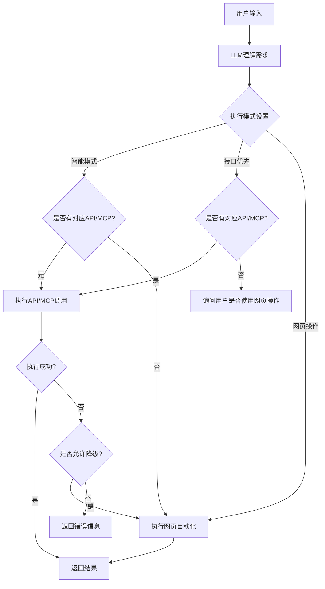

# Agent助手 技术设计文档

## 1. 项目概述
Agent助手是一款基于Electron + React开发的跨平台桌面端本地化AI助手，支持「接口/MCP调用」+「网页自动化」双执行模式，帮助用户自动化完成各类业务操作。

### 1.1 核心特性
- 跨平台支持：Windows 7/10/11、macOS 10.15+
- 双执行模式：智能选择最优执行方式
- 内置WebView：无缝集成现有Web系统
- 本地化部署：所有数据本地存储，无数据泄露风险
- 可扩展架构：支持灵活添加新的API映射和MCP服务

### 1.2 技术栈
| 层级 | 技术选型 | 版本 | 说明 |
|------|----------|------|------|
| 客户端框架 | Electron | 28.x | 跨平台桌面应用框架 |
| UI框架 | React | 18.x | 前端UI框架 |
| UI组件库 | Ant Design | 5.x | 企业级组件库 |
| 构建工具 | Vite | 5.x | 前端构建工具 |
| AI框架 | LangChain.js | 0.1.x | LLM应用开发框架 |
| 网页自动化 | Playwright | 1.40.x | 网页自动化测试框架 |
| 网络请求 | Axios | 1.6.x | HTTP客户端 |
| 本地存储 | SQLite | 5.x | 本地关系型数据库 |
| 加密存储 | electron-safe-storage | 0.1.x | 系统级加密存储 |
| 编程语言 | TypeScript | 5.x | 类型安全的JavaScript |

---

## 2. 系统架构

### 2.1 整体架构
```
┌─────────────────────────────────────────────────────────┐
│                        渲染进程                          │
│  ┌──────────┐  ┌──────────┐  ┌──────────┐  ┌──────────┐  │
│  │  UI组件  │  │ 状态管理 │  │ 核心模块 │  │ 工具函数 │  │
│  └──────────┘  └──────────┘  └──────────┘  └──────────┘  │
└───────────────────────────┬─────────────────────────────┘
                            │ IPC 通信
┌───────────────────────────┼─────────────────────────────┐
│                        主进程                          │
│  ┌──────────┐  ┌──────────┐  ┌──────────┐  ┌──────────┐  │
│  │ 窗口管理 │  │ 托盘菜单 │  │ IPC处理  │  │ 系统API  │  │
│  └──────────┘  └──────────┘  └──────────┘  └──────────┘  │
└───────────────────────────┬─────────────────────────────┘
                            │ 系统调用
┌───────────────────────────┼─────────────────────────────┐
│                       操作系统                          │
│  ┌──────────┐  ┌──────────┐  ┌──────────┐  ┌──────────┐  │
│  │ 文件系统 │  │ 网络请求 │  │ 加密存储 │  │ 系统托盘 │  │
│  └──────────┘  └──────────┘  └──────────┘  └──────────┘  │
└─────────────────────────────────────────────────────────┘
```

### 2.2 模块划分

#### 2.2.1 主进程模块 (`electron/main/`)
| 模块 | 职责 |
|------|------|
| `index.ts` | 主进程入口，窗口创建、生命周期管理、系统初始化 |
| `ipc.ts` | IPC通信处理，注册所有主进程调用接口 |
| `tray.ts` | 系统托盘/菜单栏实现，适配Windows/macOS |
| `preload.ts` | 预加载脚本，暴露安全的Electron API给渲染进程 |

#### 2.2.2 渲染进程模块 (`src/`)
| 模块 | 职责 |
|------|------|
| `api/` | 核心业务逻辑层 |
| `api/llm.ts` | 大模型调用封装，支持多厂商模型 |
| `api/apiClient.ts` | 后端接口调用客户端，支持多鉴权、重试 |
| `api/mcpClient.ts` | MCP服务调用客户端，实现MCP协议 |
| `api/webAutomation.ts` | 网页自动化核心，操控WebView |
| `components/` | React通用组件 |
| `pages/` | 页面组件 |
| `context/` | 全局状态管理（React Context） |
| `config/` | 静态配置文件 |
| `types/` | TypeScript类型定义 |
| `utils/` | 通用工具函数 |

### 2.3 数据流
```
用户输入 → LLM理解 → 模式决策 → 执行模块 → 结果返回 → 自然语言生成
           ↓           ↓         ↓
        接口调用    MCP调用   网页自动化
```

---

## 3. 核心功能实现

### 3.1 双执行模式原理

#### 3.1.1 模式决策流程


#### 3.1.2 LLM Prompt模板
```
你是"云管家工作台"的AI助手，需完成以下任务：
1. 理解用户自然语言需求；
2. 根据当前执行模式判断执行方式：
   - 如模式为auto：判断该需求是否可通过「后端接口/MCP服务」执行（参考接口映射库）；
   - 如模式为api：强制使用接口执行，若无对应接口则返回ask模式询问用户；
   - 如模式为web：强制使用网页自动化执行。
3. 若可通过接口/MCP执行：输出JSON格式，包含mode="api/mcp"、action（业务动作）、params（接口请求参数）、apiConfig（接口地址/鉴权/方法）；
4. 若不可通过接口/MCP执行：输出JSON格式，包含mode="web"、steps（网页自动化步骤数组）；
5. 若需求不明确，输出JSON格式，包含mode="ask"、content（需要确认的问题）。
```

### 3.2 接口/MCP调用实现

#### 3.2.1 接口调用流程
1. 根据业务动作查找对应的API映射配置
2. 路径参数替换：将`/users/{userId}`中的占位符替换为实际参数
3. 鉴权处理：根据配置注入对应的鉴权头（Token/API Key/Basic Auth等）
4. 发送HTTP请求，支持重试机制（指数退避）
5. 响应解析和错误处理，格式化返回结果

#### 3.2.2 MCP协议实现
MCP（Model Context Protocol）是标准化的大模型服务调用协议，实现：
- 能力发现：`GET /v1/capabilities` 获取服务能力列表
- 能力执行：`POST /v1/capabilities/{name}/execute` 执行具体能力
- 健康检查：`GET /v1/health` 检查服务状态

### 3.3 网页自动化实现

#### 3.3.1 WebView操控原理
通过Electron WebView的`executeJavaScript`方法注入JS代码，实现对网页的操控：
```typescript
// 点击元素
await webview.executeJavaScript(`document.querySelector('${selector}').click()`)

// 输入文本
await webview.executeJavaScript(`
  const input = document.querySelector('${selector}')
  input.value = '${value}'
  input.dispatchEvent(new Event('input'))
`)
```

#### 3.3.2 元素等待机制
实现智能元素等待，避免页面未加载完成导致的操作失败：
```typescript
async function waitForSelector(selector: string, timeout: number = 5000) {
  const startTime = Date.now()
  while (Date.now() - startTime < timeout) {
    const exists = await webview.executeJavaScript(`
      document.querySelector('${selector}') !== null
    `)
    if (exists) return
    await sleep(100)
  }
  throw new Error(`元素未找到: ${selector}`)
}
```

### 3.4 IPC通信机制

#### 3.4.1 通信频道设计
| 频道 | 方向 | 用途 |
|------|------|------|
| `encrypt` | 渲染→主 | 加密敏感数据 |
| `decrypt` | 渲染→主 | 解密敏感数据 |
| `api-call` | 渲染→主 | 执行API调用 |
| `mcp-call` | 渲染→主 | 执行MCP调用 |
| `web-automation-action` | 渲染→主 | 执行网页自动化操作 |
| `navigate` | 主→渲染 | 主进程通知渲染进程路由跳转 |

#### 3.4.2 安全设计
- 启用`contextIsolation: true`，主进程和渲染进程上下文隔离
- 预加载脚本仅暴露必要的API，不直接暴露Electron核心API
- 所有跨进程通信数据都经过序列化和校验

### 3.5 存储设计

#### 3.5.1 加密存储
敏感信息（API密钥、Token等）使用系统级加密存储：
- Windows：使用DPAPI加密
- macOS：使用Keychain存储
- 加密解密操作都在主进程执行，渲染进程无法直接访问原始密钥

#### 3.5.2 日志存储
使用SQLite存储操作日志，支持按类型、时间、级别查询：
```sql
CREATE TABLE logs (
  id INTEGER PRIMARY KEY AUTOINCREMENT,
  type TEXT NOT NULL,
  level TEXT NOT NULL,
  content TEXT NOT NULL,
  data TEXT,
  timestamp INTEGER NOT NULL
)
```

---

## 4. 开发指南

### 4.1 环境搭建
```bash
# 1. 环境要求
Node.js >= 18.0.0
npm >= 9.0.0

# 2. 克隆项目
git clone git@github.com:Alansad/cloudAgent.git
cd cloudAgent

# 3. 安装依赖
npm install

# 4. 开发模式
npm run dev

# 5. 生产构建
npm run build
```

### 4.2 开发规范

#### 4.2.1 代码规范
- 使用TypeScript，禁止使用`any`类型，所有变量和函数必须有类型定义
- React组件使用函数式组件 + Hook，禁止Class组件
- 文件名使用PascalCase（组件）或camelCase（工具、配置）
- 代码提交使用约定式提交：`feat: 新增功能`、`fix: 修复bug`、`docs: 文档更新`

#### 4.2.2 组件设计原则
- 单一职责原则：一个组件只做一件事
- 组件粒度适中，避免过大的组件
- 通用组件放在`src/components/`，业务组件放在对应页面目录下
- 组件Props必须有TypeScript类型定义，必要时添加JSDoc注释

### 4.3 扩展开发

#### 4.3.1 添加新的API映射
1. 在设置页面-API映射配置中新增，或直接修改`src/config/apiMapping.json`
2. 配置项说明：
```json
{
  "id": "唯一标识",
  "action": "业务动作名称",
  "description": "动作描述",
  "endpoint": "接口地址，支持路径参数{param}",
  "method": "GET/POST/PUT/DELETE",
  "authType": "none/token/apiKey/basic/oauth2",
  "paramsSchema": "请求参数JSON Schema",
  "timeout": 10000
}
```

#### 4.3.2 添加新的MCP服务
1. 在设置页面-MCP服务配置中新增
2. 实现MCP服务端需要遵循MCP协议规范，提供三个接口：
   - `GET /v1/health` 健康检查
   - `GET /v1/capabilities` 能力列表
   - `POST /v1/capabilities/{name}/execute` 执行能力

#### 4.3.3 添加新的网页自动化操作
在`src/api/webAutomation.ts`的`executeStep`方法中添加新的action类型：
```typescript
case 'new-action':
  // 实现新的操作逻辑
  return { success: true }
```

### 4.4 调试指南

#### 4.4.1 主进程调试
```bash
# 启动Electron时添加调试参数
electron . --inspect=9229
```
在Chrome浏览器打开`chrome://inspect`，添加目标`localhost:9229`进行调试。

#### 4.4.2 渲染进程调试
- 开发模式下按`F12`打开开发者工具
- 或在代码中添加`debugger`语句

#### 4.4.3 WebView调试
在WebView上右键选择"审查元素"，打开WebView的开发者工具。

---

## 5. 性能优化

### 5.1 内存优化
- 及时清理事件监听器，避免内存泄漏
- 对话记录分页加载，避免过多DOM节点
- WebView开启进程隔离，避免内存泄漏

### 5.2 启动优化
- 启用Vite构建的代码分割和懒加载
- 主进程启动时只加载必要模块，非核心模块延迟加载
- 资源预加载，减少首屏加载时间

### 5.3 执行优化
- 接口调用并行化，无依赖的请求同时发送
- 网页操作批量执行，减少IPC通信次数
- 智能重试机制，失败请求使用指数退避策略

---

## 6. 问题排查

### 6.1 常见错误
| 错误 | 原因 | 解决方案 |
|------|------|----------|
| WebView加载失败 | 网络问题或地址错误 | 检查网络连接和工作台地址配置 |
| 接口调用401 | 身份验证失败 | 重新配置认证Token |
| 元素未找到 | 页面结构变化或加载慢 | 增加超时时间，更新选择器 |
| 大模型调用失败 | API密钥错误或网络问题 | 检查API密钥配置和网络 |

### 6.2 日志查看
- 日志文件位置：
  - Windows：`%APPDATA%\Agent助手\logs\`
  - macOS：`~/Library/Logs/Agent助手/`
- 日志级别：info/warn/error/debug，默认记录info及以上级别

---

## 7. 版本规划

### v1.1  roadmap
- [ ] 支持自动更新
- [ ] 添加插件系统，支持第三方扩展
- [ ] 支持更多大模型厂商
- [ ] 操作录制功能，自动生成自动化步骤
- [ ] 支持定时任务和计划执行

### v1.2 roadmap
- [ ] 多账号支持
- [ ] 团队协作功能
- [ ] 操作审计和回溯
- [ ] 自定义工作流编排
- [ ] 数据统计和分析面板
